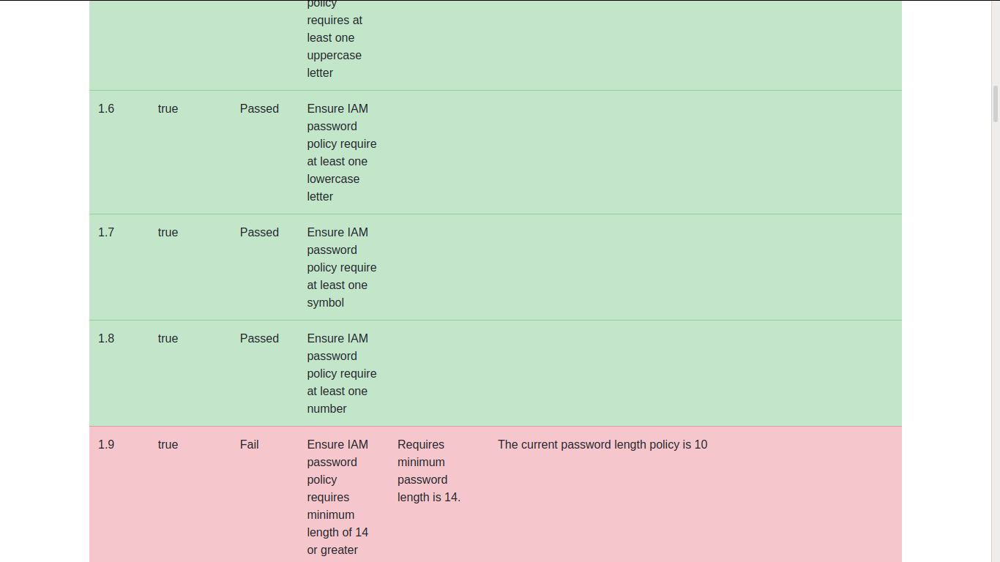

# aws-cis-security-benchmark

This script will evaluate your AWS account against CIS Amazon Web Services Foundations Benchmark `v1.2.0 - 05-23-2018`. It automates the entire checklist, instead of manually checking each control. The policy script `aws_script_policy.json` is minimum permission that this script need to execute in AWS environment.




## Dependencies
- Need to install `awscli` in to your machine
- `python3` must be installed.Now follow these steps
- Type `aws configure` in CLI.
- Now enter the Access Key, secret key and choose you region
## How to Setup and run

First of all install the dependencies.

> `pip install -r requirements.txt`

```
usage: python3 aws-cis-benchmark.py [optional arguments]

Tool to benchmark your AWS environment against CIS

optional arguments:
  -h, --help            show this help message and exit
  -c, --csv             Produces report in CSV format
  -ht, --html           Produces report in HTML format
  -j, --json            Produces report in JSON format
  -v, --version         Display version of the tool
  -f FILE_NAME, --file_name FILE_NAME
                        To store output with given file name
  -p PATH, --path PATH  To store output in specified file path
```

- **FILE_NAME** - it's an optional argument, if no value is given the filename will be `aws_cis_benchmark_output.{json|csv|html}`.
- **PATH** - it's an optional argument, if no value is given the output path will the `current directory` where you run this script.

## Features

This script helps you save the report in three formats, they are:

- JSON
- CSV
- HTML

## JSON Structure

```
[
    {
    'control_id': 'string',
    'result': bool | null,
    'scored': bool,
    'desc', 'string',
    'fail_reason': ['string',],
    'offenders': ['string,]
    },
]
```

- (Array)
  - Object
    - **control_id** (string) - Has the cis control number such as '1.1', etc.
    - **result** (bool | null) - If the `true`, the control has passed, if `false` the control has failed, if `null` the control is not assesed.
    - **scored** (bool) - If `true` the control is scored, if `false` the control is not scored [According to CIS].
    - **desc** (string) - The description of the control for the AWS CIS Benchmark foundations.
    - **fail_reason** (Array)
      - **string** - The reason why the control failed, if result is `false`, otherwise it will be empty.
    - **offenders** (Array)
      - **string** - The offenders who cause the control to fail, if result is `false`, otherwise it will be empty.

## CSV Format

The CSV document is delimited with `;` (because i had hard time implementing it in `,`). So while opening it use `;` as **only** delimiter without fail, otherwise the report will be in a messy format.

## HTML Report

This report contains the Doughnut chart of each section that are `Passed, Failed, Not Assessed` and table with responsive format.

If the table background color is `green`, then it is a `Passed` control. If `red` then it is `Failed` control, if `yellow` then the control is not assessed and it should be assesed manually, because there no API is available to perform the action.

- Dependencies
  - You need an **active internet** connection in order to view report in better format because it has these dependencies.
    - Chart.js - for the doughnut chart.
    - bootstrap - for the responsive design.
    - Jquery - for the DOM manipulation

## KUDOS

This tool was inspired by these tools:
* aws-security-benchmark - https://github.com/awslabs/aws-security-benchmark
* SeBAz - https://github.com/Deepak710/SeBAz